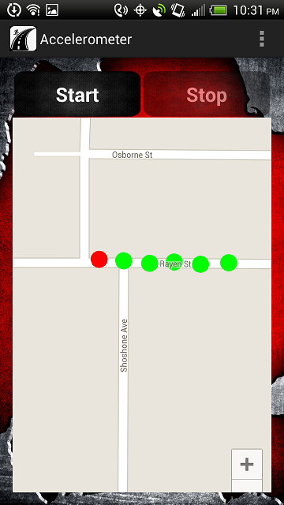

# Road Conditions Android app

Android app that gathers road condition data while the user is jogging.
Makes use of the phone's accelerometer and filtering algorithms
to identify road defects even with different unique app users.

Start screen

Countdown to allow the user to settle into steady gait

Stats are displayed when data collection is stopped

Map with route marked with road condition verdicts is displayed when the user presses View Results

## The Nitty Gritty

Once the user starts the app and after an initial countdown, the
accelerometer begins reporting data at its fastest speed. A high-pass filter is then
applied to this raw data to remove the force of gravity. The
filtered data is then used for calculating the mean and standard
deviation. These calculations, along with the filtered data, are
used for analysis to find any anomalies that might indicate bumps
or other undesirable road conditions. The verdict from the
analysis and the relevant data is recorded into two CSV files that
can be accessed using Excel from the phone’s internal storage.
This process repeats until manually stopped by the user. 